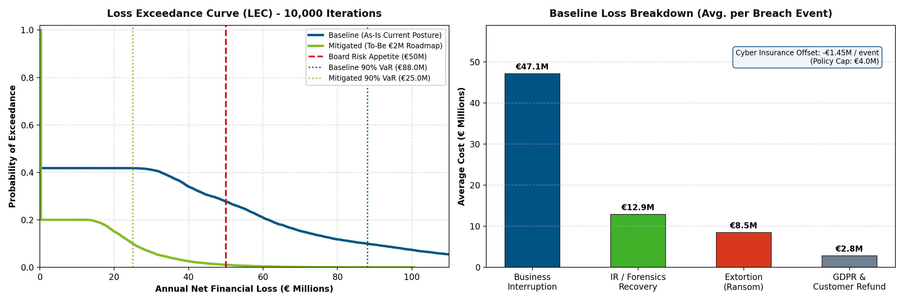

# Carremax Cyber Risk Quantification (CRQ) - FAIR Monte Carlo Framework & Executive Dashboard

[](https://www.opengroup.org/certifications/openfair)
[](https://www.python.org/)
[]()

This repository provides an enterprise-grade **Cyber Risk Quantification (CRQ)** simulation engine and automated executive reporting framework based on the **Open FAIR™ standard** (Factor Analysis of Information Risk) and **ISO/IEC 27005**. 

It quantifies the financial risk exposure of **Carremax** (a major European sports retail enterprise), models non-linear business interruption downtime, recovery forensics costs, extortion/ransom thresholds, and cyber insurance offsets, and evaluates the **Return on Security Investment (ROSI)** for a €2M security automation roadmap.

---

## 📁 Repository Structure

```text
challenge/
├── fair_simulation.py        # Core FAIR Monte Carlo simulation engine (10,000 iterations)
├── fair_report_generator.py # Executive PDF dashboard generator (WeasyPrint / HTML5)
├── CRQ_Dashboard_Template.pdf# 2-Page Board-ready executive PDF report
├── lec_curve_output.png      # Loss Exceedance Curve (LEC) & Loss breakdown charts
├── lec.png                   # High-resolution chart asset embedded in the PDF dashboard
├── requirements.txt         # Python dependency definitions
├── .gitignore               # Environment & OS ignore rules
└── README.md                # Comprehensive project documentation
```

---

## 🏢 Business Context: Carremax Case Study

- **Industry & Revenue**: Major European sports retail group (€40B revenue tier).
- **Sales Channels**: 70% physical retail stores, 30% digital e-commerce.
- **Crown Jewels**: **ERP System** and **Supply Chain Logistics**, dictating fulfillment for both physical and digital channels.
- **Threat Landscape**: Targeted ransomware attempts estimated at 1.0–2.0 times per year (Cyentia IRIS 2025 retail baseline).
- **Defensive Posture & Gaps**:
  - 90% EDR coverage (leaving a 10% standard IT server gap).
  - 0% visibility into Operational Technology (OT) and supply chain logistics assets.
  - Highly manual incident response processes, leading to critical recovery bottlenecks.
- **Board Risk Appetite**: Strictly capped at **€50,000,000**. Any annual loss exceeding €50M is classified as highly critical and destabilizing.
- **Cyber Insurance Policy**:
  - Annual Premium: €300,000.
  - Coverage: €500,000 per week of business interruption.
  - Maximum Payout: Capped at 8 weeks (€4,000,000 total payout per event).

---

## 🔬 FAIR Model Decomposition & Calibration

| FAIR Parameter | Calibration (Min / Mode / Max) | Operational & Industry Justification |
| :--- | :---: | :--- |
| **Threat Event Frequency (TEF)** | $\text{PERT}(1.0, 1.5, 2.0)\text{ / yr}$ | Cyentia IRIS 2025 retail sector rate and peer benchmark (2 attacks in 3 years). |
| **Vulnerability (Vuln)** | $\text{PERT}(15\%, 35\%, 60\%)$ | 90% EDR baseline; 10% IT gap & 0% OT visibility allow lateral threat propagation. |
| **Downtime Duration ($d$)** | $\text{PERT}(1.0, 2.0, 4.5)\text{ weeks}$ | Existing backups maintain degraded operations up to 2 weeks; manual IR prolongs outages. |
| **Business Interruption (BI)** | Non-linear: €15M/1w, €30M/2w, €50M/3w, €90M/4w | Direct gross sales loss across 70% retail and 30% e-commerce channels. |
| **IR & Forensic Recovery** | $\text{PERT}(€5.0\text{M}, €10.0\text{M}, €15.0\text{M})$ | External incident response teams, digital forensics, crisis communication, and rebuild costs. |
| **Secondary Loss: Ransom** | Capped at €20.0M | Executive willingness to pay; model triggers extortion negotiation if downtime exceeds 2 weeks. |
| **Secondary Loss: GDPR/Refunds** | $\text{PERT}(€0\text{M}, €2.0\text{M}, €5.0\text{M})$ | CNIL regulatory reporting, customer compensation, and checkout conversion drop. |
| **Cyber Insurance Offset** | €500k/week (Cap: €4.0M) | Pays out an average of €1.45M per breach event against a €300k annual premium. |

### Non-Linear Business Interruption Mapping
Carremax's operational resilience exhibits a non-linear threshold effect:
```python
def calculate_downtime_loss(duration_weeks):
    # 0 to 1 Week:  €0 to €15M
    # 1 to 2 Weeks: €15M to €30M (Limit of degraded backup operations)
    # 2 to 3 Weeks: €30M to €50M (Breaches Board Risk Appetite threshold)
    # 3 to 4 Weeks: €50M to €90M (Catastrophic supply chain / ERP paralysis)
    # > 4 Weeks:    €90M + €40M/week thereafter
```

---

## 📊 Quantitative Simulation Results (10,000 Iterations)

| Metric | As-Is Baseline (Current State) | To-Be Mitigated (€2M Roadmap) | Delta / Business Impact |
| :--- | :---: | :---: | :---: |
| **Annual Breach Probability** | **41.8%** | **20.1%** | **-51.9% reduction** |
| **Annualized Expected Loss (Net AEL)** | **€29.53M / yr** | **€5.88M / yr** | **€23.65M/yr net risk reduction** |
| **90% Value at Risk (90% VaR)** | **€88.05M** *(Non-Compliant)* | **€25.01M** *(Compliant)* | **-71.6% reduction (Within Appetite)** |
| **95% Value at Risk (95% VaR)** | **€112.26M** | **€32.65M** | **Tail risk controlled** |
| **P(Loss > €50M Board Appetite)** | **27.8%** *(Severe Exposure)* | **1.1%** *(Near Zero)* | **-96.0% reduction in catastrophic risk** |
| **Expected Breach Downtime** | **2.89 weeks** | **< 1.00 week** | Preserves backup viability |
| **ROSI on €2M Investment** | — | **1,082.3%** | **€21.65M net annual benefit** |

---

## 📈 Visualizations & Loss Exceedance Curve (LEC)



1. **Loss Exceedance Curve (LEC)**:
   - Visualizes the probability of exceeding any given financial threshold in a single year.
   - Demonstrates that the baseline posture incurs a **27.8% chance** of breaching the Board's €50M Risk Appetite, whereas the €2M mitigated posture compresses this probability to **1.1%**.
2. **Loss Component Breakdown**:
   - Primary driver is Business Interruption (€47.1M average per breach), followed by IR/Forensics (€12.9M) and Extortion (€8.5M).
   - Cyber insurance offsets ~€1.45M per event, highlighting substantial underinsurance.

---

## 🚀 Quick Start Guide

### 1. Prerequisites & Environment Setup

Ensure Python 3.9+ is installed. Clone the repository and install dependencies:

```bash
# Clone repository
git clone https://github.com/Cxxire/carremax-cyber-risk-quantification.git
cd carremax-cyber-risk-quantification

# Create and activate virtual environment
python3 -m venv .venv
source .venv/bin/activate

# Install required packages
pip install -r requirements.txt
```

### 2. Running the Monte Carlo Simulation

Run the simulation script to compute 10,000 iterations and output metrics to the console:

```bash
python fair_simulation.py
```

### 3. Generating the Executive PDF Dashboard

Generate the board-ready, two-page landscape PDF dashboard report:

```bash
python fair_report_generator.py
```
*Output generated: `CRQ_Dashboard_Template.pdf` and `lec.png`.*

---

## 📋 Executive Recommendations for the Board of Directors

1. **Approve €2M Security Automation CapEx/OpEx**:
   - Automate incident response and recovery playbooks to compress downtime from ~3 weeks to < 1 week.
   - Yields a **1,082% Return on Security Investment (ROSI)** and eliminates tail risk.
2. **Close 10% IT Gap & Enforce OT Visibility**:
   - Expand EDR deployment to 100% of servers and implement passive OT network monitoring across supply chain logistics hubs.
3. **Renegotiate Cyber Insurance Policy**:
   - Current €4.0M maximum payout covers less than 5% of catastrophic outage losses. Recommend restructuring policy to increase business interruption sub-limits to €25M–€30M.

---

## 📜 Methodology & Standards Compliance

- **Open FAIR™ Standard**: Quantitative Risk Analysis (ISO/IEC 27005 & NIST SP 800-30 aligned).
- **Statistical Modeling**: PERT probability distribution sampling with compound Poisson-Bernoulli process.
- **Reporting**: Executive Board-ready layout rendered via WeasyPrint HTML/CSS Paged Media.
